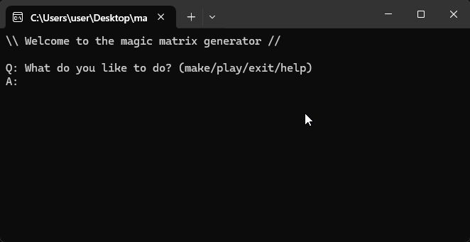

# Matrix-generator-for-magic-trick
It helps magicians memorize the mathematical formula used in a mind-reading magic trick.

<p> 
   
</p> 

<br>

## 🛠️ Why I Built This
- I’ve always found magic squares fascinating and wanted to create a magic trick about it.
- Since the formula in that trick requires mental calculation, I designed a program to help me practice it.
- It’s a fun way to practice C++ logic and chrono timing features.

<br>

## 🧩 Features
- 🔧 **Magic Matrix Maker** – Instantly generate a 4×4 magic square with any total sum.
- 🎮 **Interactive Game Mode** – Enter numbers to match the target total.
- ✅ **Auto Answer Check** – Highlights wrong numbers and counts mistakes.
- 🕐 **Time Tracker** – Measures how long you take to complete the puzzle.
- ⌨️ **Command System** – Easily control game flow with short commands.

<br>

## 📂 Project Structure
```
Magic Matrix/
├── image/                # Demonstration gif
├── LICENSE               # MIT license
├── magic_matrix.cpp      # Main source code (core logic & game loop)
├── magic_matrix.exe      # Compiled executable
└── README.md             # Project documentation
```

<br>

## ⚙️ Requirements
- **Compiler:** C++11 or higher  
- **Operating System:** Windows / macOS / Linux  
- **Optional:** Precompiled `magic_matrix.exe` (you can skip compilation if it’s available)

<br>

## ▶️ How to Run
To start the program after compilation:  
- **Windows:** `magic_matrix.exe`
- **Linux / macOS:** `./magic_matrix`

<br>

## 💡 Tips for Magicians
Let me shrare an idea for a trick related to the magic matrix.

#### [Performance]
1. The magician asks the spectator to think of a **number n between 1 and 100**.
2. Ask the spectator to use a calculator to compute **n × 67**.
3. The spectator tells the magician only the **last two digits** of the result.
4. The magician draws a **4×4 grid** and says: “Is the number you thought of somewhere in here?”
5. The spectator says **no**.
6. The magician then reveals:
> “No matter which line you choose — vertical, horizontal, or diagonal — or even any group of four adjacent cells, their **sum is your number n!**”

<br>

#### [The Secret]
Once the magician hears the last two digits (**m**) from the spectator, he secretly calculates:  
> **n = (m × 3) mod 100**

The result is exactly the number the spectator originally thought of.  

<br>

After finding out the number **n**, the magician creates a **4×4 magic square** using the following formula:  
> (n − 30) ÷ 4 = m with remainder k

The magician mentally calculates the numbers in the magic square by substituting m and k into the template.

<br>

**Magic Square Template**
|   | A          | B         | C          | D |
|---|------------|-----------|------------|---|
| 1 | m          | m + 7     | m + 10     | m + 13 + k |
| 2 | m + 14     | m + 9 + k | m + 4      | m + 3 |
| 3 | m + 5      | m + 2     | m + 15 + k | m + 8 |
| 4 | m + 11 + k | m + 12    | m + 1      | m + 6 |

<br>

**Relation Pattern** 
|   | A      | B      | C      | D |
|---|--------|--------|--------|---|
| 1 | m      | A1 + 7 | B1 + 3 | C1 + 3 + k |
| 2 | D1 + 1 | C1 - 1 | B1 - 3 | A1 + 3 |
| 3 | C2 + 1 | D2 - 1 | A2 + 1 | B2 - 1 |
| 4 | D3 + 3 | C3 - 3 | B3 - 1 | A3 + 1 |

<br>

**Example:** sum = 99  
(99 - 30) / 4 = 17 with remainder 1 (m = 17, k = 1)
|   | A  | B  | C  | D |
|---|----|----|----|---|
| 1 | 17 | 24 | 27 | 31 |
| 2 | 32 | 26 | 21 | 20 |
| 3 | 22 | 19 | 33 | 25 |
| 4 | 28 | 30 | 18 | 23 |

<br>

## 📜 License
This project is released under the **MIT License**.  
You are free to modify and use it for learning, personal, or performance purposes.  

**I hope you like the trick. ^_^**

